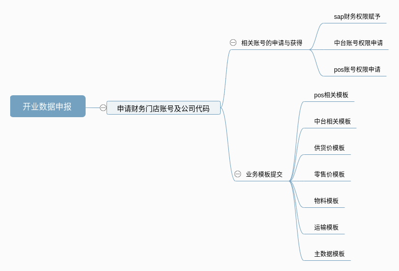
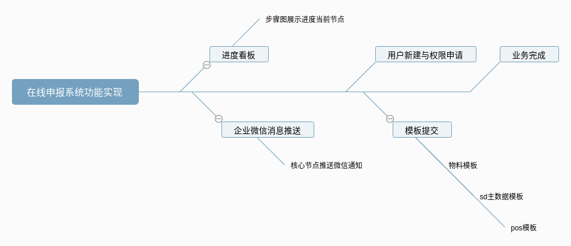
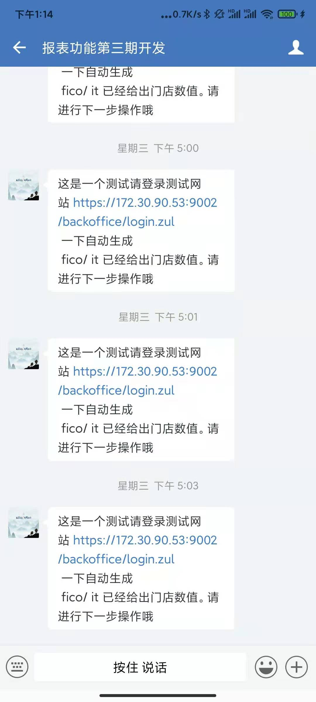

# 
门店开店数据快捷填报系统</enter>

## 编写目的
 1. 编写门店开店数据快捷填报系统的需求分析报告的目的，是为了特许门店快捷填报数据的准确性，时效性，进度可追溯性。也是时代背景的需要，将业务放在云上，实现协同办公，业务系统化。
 2. 背景
   + 为了满足特许明年1200家开店计划，实现开店业务高效运转。
   + 业务融合进入“特许服务商平台”。增加服务平台权重。
   + 联动消息通知，做到数据递交进度可查，核心进度点高效通知。提高信息传递，减少共同成本。
   

## 项目目标
+ 实现主数据申报，直接在“特许服务商平台”填报。步骤化进行，各个部门配合填写，最终在线申报成功。
+ 提高工作效率，让门店申报实现系统化的在线申报。

### 业务概述
+ 申请开业门店现在的模式是各个模块的主数据成模块下的聚合在一起，然后打包成excl的形式提交。

+ 以前都是线下实现的业务。往后将以上搬到“特许服务商平台”实现。

### 系统概述
+ 系统业务模块描述
>> 在线申报系统一下几个模块组成
进度看板，企业微信消息推送服务，用户新建与权限申请，模板上传提交。
#### 功能实现

+  进度看板
  用步骤条实现，在线申报的业务进度查看，做到进度了然于心。
  
+ 企业微信推送服务
  实现请求参数可维护可拓展。发送文本可维护可拓展。
  微信token的获取,并实现发送请求参数可维护,并且发送给企业微信指定接受人员

      

+ 用户权限与角色在线申请
实现用户角色在线申请。

  
 + 物料主数据导入实现
 实现批量导入功能,可以通用pos数据导入，供货价，零售价导入。主数据导入等。
  

### 运行环境
+ mysql5.7，java1.8，linux服务器，融合进入特许服务商平台，企业微信第三方自用开发程序入口。
  

### 接口说明
+ 涉及接口不多，主要需要企业微信的后台配置id参数，实现消息推送的功能。
+ url：https://qyapi.weixin.qq.com/cgi-bin/message/send?
+ 参数	必须	说明
corpid	是	企业ID，获取方式参考：术语说明-corpid
corpsecret	是	应用的凭证密钥，获取方式参考：术语说明-secret
* touser	否	指定接收消息的成员，成员ID列表（多个接收者用‘|’分隔，最多支持1000个）。
 * 特殊情况：指定为”@all”，则向该企业应用的全部成员发送
 * toparty	否	指定接收消息的部门，部门ID列表，多个接收者用‘|’分隔，最多支持100个。
 * 当touser为”@all”时忽略本参数
 * totag	否	指定接收消息的标签，标签ID列表，多个接收者用‘|’分隔，最多支持100个。
 * 当touser为”@all”时忽略本参数
 * msgtype	是	消息类型，此时固定为：text
 * agentid	是	企业应用的id，整型。企业内部开发，可在应用的设置页面查看；第三方服务商，可通过接口 获取企业授权信息 获取该参数值
 * content	是	消息内容，最长不超过2048个字节，超过将截断（支持id转译）
 * safe	否	表示是否是保密消息，0表示否，1表示是，默认0
 * enable_id_trans	否	表示是否开启id转译，0表示否，1表示是，默认0
 * enable_duplicate_check	否	表示是否开启重复消息检查，0表示否，1表示是，默认0
 * duplicate_check_interval	否	表示是否重复消息检查的时间间隔，默认1800s，最大不超过4小时
 * touser、toparty、totag不能同时为空，后面不再强调。
 *

### 扩展需求
+ 选用的框架带有自适应配置，对未来拓展小程序手机app都由参考意义，和保持界面体验都由一定帮助。
+ 涉及企业微信消息推送业务，设计成可维护状态，后期能实现推送业务自定义。
